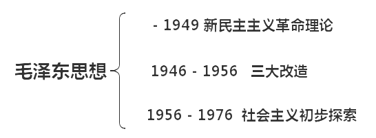

# 毛泽东思想

## 形成的历史条件

1. 时代背景：世界无产阶级社会主义革命的新时代
2. 实践基础：中国共产党领导人民进行革命和建设成功实践(经验)

## 形成过程

|         时期         | 形成阶段 |                             著作                             |
| :------------------: | :------: | :----------------------------------------------------------: |
|      大革命时期      | 提出思想 |       《中国社会各阶级的分析》《湖南农民运动考察报告》       |
|     土地革命时期     | 初步形成 | 《中国红色政权为什么能够存在？》《井冈山的斗争》 《星星之火，可以燎原》《反对本本主义》 |
|    遵义会议到抗战    | 趋于成熟 | 《实践论》《矛盾论》《论持久战》《（共产党人）发刊词》 《中国革命和中国共产党》《新民主主义论》 |
|       中共七大       | 正式确立 |                        《论联合政府》                        |
| 解放战争和中国成立后 | 继续发展 | 《在晋绥干部会议上的讲话》《论人民民主专政》《论十大关系》 《正确处理人民内部矛盾的问题》 |

## 活的灵魂

十一届六中全会通过了《中国共产党中央委员会关于建国以来党的若干历史问题的决议》(简称《历史决议》)毛泽东思想活的灵魂是：实事求是(根本思想路线)、群众路线(根本工作路线)、独立自主(根本政治原则)。

## 历史地位

1. 是马克思主义中国化的第一个重大理论成果。
2. 是中国革命和建设的科学指南。
3. 是中国共产党和中国人民宝贵的精神财富。

# 新民主主义革命理论(1949年之前)

## 背景

- 国情：近代中国已经沦为一个半殖民地半封建性质的社会。
- 主要矛盾:帝国主义和中华民族的矛盾、封建主义和人民大众的矛盾。在半殖民地半封建的近
    代中国，社会矛盾呈现出错综复杂的状况，在诸多社会矛盾中，帝国主义和中华民族的矛盾，
    是各种矛盾中最主要的矛盾。
- 根本任务:推翻帝国主义、封建主义和官僚资本主义的统治
- 革命性质:资产阶级民主革命
- 中国革命要分两步走，第一步是完成反帝反封建的新民主主义革命任务，第二步是完成社会主
    义革命任务，这是性质不同但又相互联系的两个革命过程。

## 新民主主义革命的总路线

### 革命的对象

###   革命的动力

### 革命的领导力量

### 革命的性质和前途

## 新民主主义革命的基本纲领

### 政治纲领

### 经济纲领

### 文化纲领

## 新民主主义革命的道路

## 新民主主义革命的基本经验

# 社会主义理论改造

## 从新民主主义到社会主义

## 社会主义改造

### 社会主义改造的道路

### 社会主义改造的历史经验

## 社会主义在中国确立

# 社会主义建设的初步探索

# 邓小平理论

# 三个代表和科学发展观

# 习近平新时代中国特色社会主义思想

# 会议

