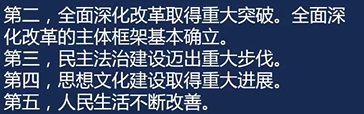

# 习近平新时代中国特色社会主义主义思想

## 新时代概述

### 背景(为什么进入了新时代)

1. 经济建设取得了重大成就，经济保持中高速增长，综合国力和国际影响力显著提升，经济总量稳居世界第二，对世界经济增长贡献率超过30%。经济结构不断优化，推动经济迈向更更高水平发展。
2. 

## “五位一体”总布局

## “四个全面”战略布局

## 国防和军队现代化

## 外交

## 坚持和加强党的领导

