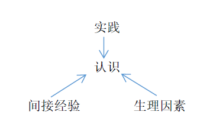

# 马原部分简答题

## 考点21 对立统一规律

### 为什么对立统一规律是唯物辩证法的实质和核心

1. **对立统一规律揭示了普遍联系的根本内容和永恒发展的内在动力，从根本上回答了事物为什么会发展的问事物题**
2. **对立统一规律是贯穿其他规律和范畴的中心线索；**
3. **对立统一规律提供矛盾分析法，它是对事物辩证认识的实质；**
4. **是否承认对立统一学说是唯物辩证法和形而上学对立的实质。**

### 矛盾的同一性和斗争性的辩证关系

1. 矛盾的同一性是指矛盾双方相互依存、相互贯通的性质和趋势。
2. 矛盾的斗争性是矛盾着对立面之间相互排斥、相互分离的性质和趋势。
3. 矛盾的同一性和矛盾的斗争性是相互联系、相辅相成的，没有斗争性就没有同一性，斗争性寓于同一性之中，没有同一性也没有斗争性。
4. 在事物的矛盾中，矛盾的斗争性是无条件的绝对的，矛盾的同一性是有条件的相对的

### 矛盾的同一性和斗争性在事物发展中的作用

矛盾的同一性在事物发展中的作用表现在：
1. 由于矛盾双方相互依存，互为存在的条件，矛盾双方可以利用对方的发展使自己得到发展；
2. 同一性使矛盾双方相互吸取有利于自身的因素，在相互作用中各自得到发展；
3. 由于矛盾双方彼此相遇，矛盾双方可以向着对彼此的对立面转化而得到发展，并规定着事物的发展方向。

矛盾的斗争性在事物发展中的作用表现在：
1. 矛盾双方的斗争促进矛盾双方力量的变化，竞长争高，此消彼长，造成事物的量变；
2. 矛盾双方的斗争，促使矛盾双方的地位和性质发生转化，实现事物的质变。

### 矛盾的普遍性和特殊性的辩证关系
1. 矛盾的普遍性是指矛盾存在于一切事物中，存在于一切事物发展过程的始终，旧的矛盾解决了，新的矛盾又产生。事物始终在矛盾中运动。
2. 矛盾的特殊性是指具体在其运动中的矛盾及每一矛盾的各个方面的都有其特点。矛盾的特殊性有三种情形：
 - 不同事物的矛盾各有其特点
 - 同一事物的矛盾在不同发展过程和发展阶段各有不同特点
 - 构成事物的诸多矛盾以及每一矛盾的不同方面各有不同的性质、地位和作用
3. 相互区别：矛盾的共性是无条件的、绝对的，矛盾的个性是有条件的、相对的。
4. 相互联系：任何现实存在的事物都是共性和个性的有机统一，共性寓于个性之中，没有离开个性的共性，也没有离开共性的个性

## 考点28 实践对认识的决定作用

1. 实践是认识的来源。首先，实践产生了认识的需要；其次，实践还为认识的形成提供了可能
2. 实践是认识的动力
3. 实践是认识的目的
4. 实践是检验认识真理性的唯一标准

## 考点30  认识的两次飞跃

### 从实践到认识（感性认识到理性认识的飞跃）

**感性认识**是人们在实践基础上，由感觉器官直接感受到的关于事物的现象、事物的外部联系、事物的各个方面的认识，包括**感觉**、**知觉**和**表象**三种形式。感性认识是认识的初级阶段，**直接性**和**具体性**是感性认识的突出特点。 

**理性认识**是认识的高级阶段，是指人们借助抽象思维，在概括整理大量感性材料的基础上，
达到关于事物的本质、全体、内部联系和事物自身规律性的认识。理性认识包括**概念**、**判断**、**推理**三种形式。理性认识的特点是它的**间接性**和**抽象性**。

#### 感性认识与理性认识的辩证关系：

1. 感性认识有待于发展和深化为理性认识。
2. 理性认识依赖于感性认识。
3. 感性认识和理性认识相互渗透、相互包含。感性认识和理性认识的辩证统一关系是在实践的基础上形成的,也需要在实践中发展。如果割裂二者的辩证统一关系，就会走向唯理论或经验论，在实际工作中就会犯教条主义错误或经验主义错误。

#### 感性认识上升到理性认识的条件：
1. 勇于实践，深入调查，获取十分丰富和合乎实际的感性材料；
2. 必须经过理性思考的作用，将丰富的感性材料加工制作。

### 从认识到实践（理性认识到实践的飞跃）
**重要性：**从认识到实践，是“认识过程的第二个阶段，即由精神到物质的阶段，由思想到存在的阶段”。这是认识过程的第二次能动的飞跃，是认识过程中更为重要的一次飞跃。

**实现飞跃的条件：**需要经过一定的中介环节，包括确定实践目的、形成实践理念、制定实践方案、进行中间实验、运用科学实践方法等。因此必须从实际出发,坚持理论和实际相结合,让理论为群众所掌握,转化为改造社会、改造自然的物质力量。只有这样，理论才能发恽指导作用，并随着实践的发展而发展。

## 考点31 认识过程中的影响因素

###  理性因素
**概念：**指人的理性直观、理性思维等能力。

**作用：**它在认识活动中的作用主要有*指导作用*、*解释作用*和*预见作用*等。

### 非理性因素（感性因素）
**概念：**非理性因素主要是指认识主体的情感和意志。从广义上看，人们还常把认识能力中具有不自觉、非逻辑性等特点的认识形式，如**联想、想象、猜测、顿悟、灵感**等，也包括在人的非理性因素中。

**作用：**非理性因素对于人的认识能力和认识活动具有*激活*、*驱动*和*控制*作用。

## 考点32  认识的两大规律

### 反复性

认识过程的反复性是指，人们对于一个复杂事物的认识往往要经过感性认识到理性认识，再由理性认识到实践的多次反复才能完成。
原因：

- 从客观看，事物暴露有个过程；
- 从主观看，主体认识能力提高有个过程

### 无限性

认识发展的无限性是指对于事物发展过程的推移来说，人类的认识是永无止境、无限发展的，它表现为“实践、认识、再实践、再认识”的无限循环，由低级阶段向高级阶段不断推移的永无止境的前进运动。这种认识的无限发展过程，在形式上是循环往复，在实质上是**前进上升**。(否定之否定规律)

## 考点34 真理

真理是标志主观与客观相符合的哲学范畴，是对客观事物及其规律的正确反映。

### 真理的客观性

真理的客观性指真理的内容是对客观事物及其规律的正确反映，真理中包含着不依赖于人和人的意识的客观内容。客观性是真理的本质属性。但真理的形式是主观的。

真理的**客观性**决定了真理的**一元性**。真理的一元性是指在同一条件下对于特定的认识客体的真理性认识只有一个，而不可能有多个。

### 真理的绝对性

真理的绝对性是指真理的内容表明了主客观统一的确定性和发展的无限性。它有两个方面的含义：

1. 任何真理都必然包含同客观对象相符合的客观内容，都同谬误有原则的界限。否则就不称其为真理，这一点是无条件的、绝对的。
2. 人类认识按其本性来说，能够正确认识无限发展着的物质世界，认识每前进一步，都是对无限发展着的物质世界的接近。这一点也是无条件的，绝对的。承认世界的可知性就
    承认了绝对真理。

### 真理的相对性

真理的相对性是指人们在一定条件下对事物的客观过程及其发展规律的正确认识总是有限度的。真理的相对性也有两个方面的含义：
1. 从客观世界的整体来看，任何真理都是对客观世界一部分一阶段的正确认识。
2. 就特定事物来看，一定方面一定层次一定程度的正确认识，深度是有限定的，真理所反
映的对象是有条件的、有限的；

### 真理的绝对性与相对性的辩证关系

1. 二者相互依存。所谓相互依存，是说人们对于客观事物及其本质和规律的每一个正确认识，都是在一定范围内、一定程度上、一定条件下的认识，因而必然是相对的和有局限性的；但是在这一定范围内、一定程度上、一定条件下，它又是对客观对象的正确反映，因而它又是无条件的、绝对的
2. 二者相互包含。所谓相互包含，一是说真理的绝对性寓于真理的相对性之中；二是说真理的相对性必然包含并表现着真理的绝对性。所以，绝对真理和相对真理是不可分的，没有离开绝对真理的相对真理，没有离开相对真理的绝对真理。无数相对的真理之总和，就是绝对的真理。
3. 在二者的辩证关系中，还要明确，真理永远处在由相对向绝对的转化和发展中，是从真理的相对性走向绝对性、接近绝对性的过程。任何真理性的认识都是由真理的相对性向绝对性转化过程中的一个环节，这是真理发展的规律。

## 考点35 真理和谬误

**相互区别：**由于真理和谬误决定于认识的内容是否如实地反映了客观事物，因此真理和谬误是性质不同的两种认识，它们是对立的。

**相互联系：**真理和谬误是统一的，它们相互依存、相互转化。真理和谬误相比较而存在，没有真理就无所谓谬误，没有谬误也无所谓真理；真理中包含着某种以后会暴露出来的错误的方面或因素，谬误中也隐藏着以后会显露出来的真理的成分或萌芽。

在一定条件下，真理和谬误可以相互转化。真理和谬误在一定范围内的对立是绝对的，
但超出一定范围，它们就会互相转化，真理变成谬误，谬误变成真理。

> 1. 同一范围内是绝对的，真理就是真理，谬误就是谬误
> 2. 在不同范围内是相对的，真理可以变成谬误，谬误也可以变成真理