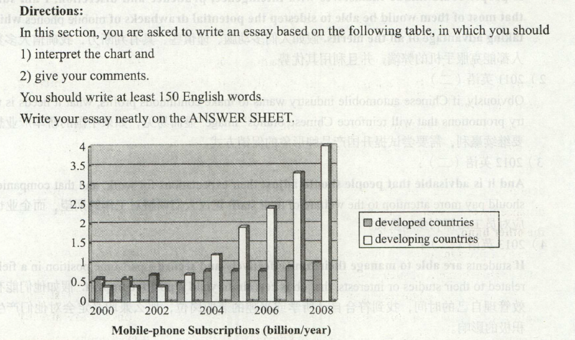

# 2010

## 小作文

Dear Bob：  
&emsp;&emsp;I have just arrived at my home from the airport. As I si down at my desk,I just want to write a letter to you to thank you for your warm reception in the cultural exchange programe. You an your family left a deep impress upon me. Indeed,the programe is one of the most wonderful memories in my life.         
&emsp;&emsp;I remember you mentions wanting to travel in China. Well,If you come to China,you will be warmly welcomed and it well be my pleasre to your guide here. If you would like,send me a list beforehand of the places you would like to visit.      
&emsp;&emsp;Please give my best regards to your family.      

## 大作文

&emsp;&emsp; From the information given in the above column chart, we can see a striking contrast between developing and developed countries in mobile-phone subscriptions from 2000 to2008. During this period, there has been a dramatic increase from 0.4 to 4 billion mobile phone subscriptions in developing countries, while that of developed countries remained steady at just under 1 billion.

&emsp;&emsp; At least two fundamental factors could have contributed to this phenomenon. On the one hand, with the rapid increase in economic development happening in developing countries, the telecommunication industry in those countries expanded greatly to meet thedemand of globalization. As a result, the user base of mobile phones which can narrow the distance between people and link the whole world together, grew at an incredible speed. On the other hand, the extremely advanced civilization of developed countries means less potential in many aspects including in the area of private telecommunication tools and their demand for further enlargement of such tools tends to saturate.

&emsp;&emsp; In conclusion, while mobile-phone subscriptions, if used carelessly or without restraint, could prove to be a double-edged sword, the fact remains that such phones are already extremely prevalent in both developing and developed countries, and even today continueto rise in popularity. If people could imbue themselves with intelligence, prudence and discretion, I am sure that most of them would be able to sidestep the potential drawbacks of mobile phones while taking advantage of all the merits.

> 根据以上柱状图提供的信息，我们可以看出，从2000年到2008年，发展中国家和发达国家在手机入网方面存在着惊人的对比。在此期间，发展中国家手机入网数从4亿急速增长到40亿，而发达国家的相关数据在10亿之下保持平稳。
>
> 至少有两点主要原因造成了这种现象。一方面，随着在发展中国家发生的快速经济增长，这些国家的电信产业必然会适应全球化的需求。因此，使用手机缩短人们之间的距离并与全世界联系的人数以惊人的速度增长。另-方面，发达国家极端先进的文明在私人电信工具等诸多领域意味着更少的发展潜力，他们对进-一步开发此类工具的需求趋于饱和。
>
> 因此，如果不小心或没有节制，手机人网就是一把双刃剑。但事实上，手机人网在发展中国家和发达国家中均十分流行，这种趋势甚至今天还在继续扩大。假如人们多动脑、谨慎些、具有判断力，我确信大多数人都能克服手机的弊端，并且利用其优势。