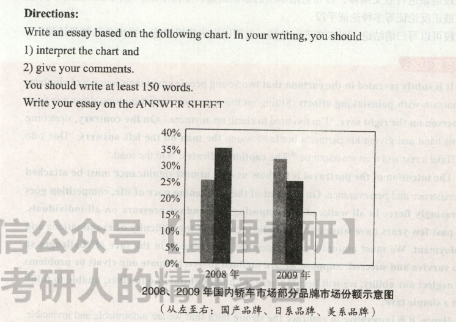

# 2011

## 小作文  

 Dear Li Ming    
 &emsp;&emsp;I'm so glad to hear that you have received an offer from BeiJing University.Congratulations! But in fact,this is no surprising - I remember seeing how you hava been working since childhood.Now you have the opportunity to learn physics,which you hava a huge interest in, in one of best Universities in China.I fell hoppy to you.      
 &emsp;&emsp;I do want to share some advice for university life with you.First of all,don't forget studying.Second,take some time konw yourself well and make your own decisions.Third,enjoy your life as long as it's your control.       
 &emsp;&emsp;I hope you will hava a wonderful time in your university. 

## 大作文

What is shown in the column chart above indicates that dramatic changes have taken place in the market shares of certain brands in the domestic car market from 2008 to 2009.During that period, there was a marked jump of 8% from 25% to 33% in the market shares of Chinese brands, while that of Japanese brands declined significantly, by 10% from 35% to25%. At the same time, the percentage of American brands remained steady.

There are at least two fundamental causes accounting for these changes. On the one hand, advancements in science and technology have offered a technical foundation for the rapid development of the Chinese automobile industry by providing a material basis and technical means. Meanwhile, it's not dificult to notice that these days national automobile companies in mounting numbers have' turned to price promotions to boost sales. On the other hand, the dishonest words and behaviors of Japanese automobile corporations such as Toyota in reent years have cheapened their image and finally ruined their reputation.

To sum up, brands are intangible treasure. They amount to a product's or a company's reputation. Obviously, if the Chinese automobile industry wants to make continuous profits, what it needs is to try promotions that will reinforce Chinese brands' images.

> 上述柱状图中 显示的数据表明，从2008年到2009年，国内轿车市场部分品牌市场份额发生了很大变化。在此期间，国产品牌的市场份额从25%急剧上升到33%，上升了8个百分点；而日系品牌的市场份额则从35%急剧下降到25%，下降了10个百分点。与此同时，美系品牌所占的百分比保持平稳。
>
> 至少两点主要原因造成了上述变化。一方面，科技进步通过提供物质基础和技术手段，为中国汽车产业的迅猛发展提供了技术基础。同时，不难发现，近年来越来越多的国产轿车公司大搞价格促销来提升销量。另一方面，近年来丰田等日系轿车公司的欺诈言行损害了其形象，并最终毁坏了其声誉。
>
> 总之，品牌是无形的财富。它们与一种产品或一家公司的声誉密不可分。显而易见，如果中国轿车产业想要继续赢利，需要尝试提升国产品牌形象的促销方式。