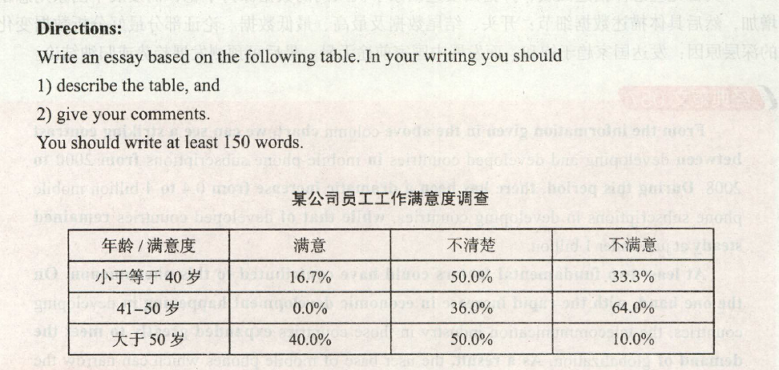

# 2012

## 小作文
Dear Sir or Madam:   
&emsp;&emsp;I bought an electronic dictionarg form your online store on January 1 st,but after using it for a short period of time. I found it has some problems.    
&emsp;&emsp;To begin with,the batter needs recharing after a mere 2 hours. This means that I need to carry my charge with me when I go out for a day.In addition,the buttons on electronic dictionary are so small that it is nearly impossable to type anything with them. Personally,I find this to be completely unacceptable.    
&emsp;&emsp;Therefore,I would like either to change for another model that works better or a full refund. Your help is greatly appreciated.    

## 大作文

The table clearly reflects the statistics of staff's job satisfaction in a certain company.According to the data given above, we can conclude that the percentage of people satisfied with their jobs is highest among those over 50 years old, at about 40%. In contrast, the percentage of the staff not satisfied with their jobs is about 64% among those in their forties, the highest among all the three age groups.

The major determinant of satisfaction lies in people's attitudes. On the one hand, staff members in their forties usually have to undertake a lot of responsibilities from both their families and their careers. Sometimes they are even under pressure to pursue money,power, high social status, and so on, which are all symbols of success. So, they have the leastsatisfaction in their jobs. On the other hand, people over 50 generally have shifted their life goals from achieving the ultimate success to a relatively easy and comfortable life, and therefore are inclined to be much mo ore satified with their jobs.

In view of the above reasoning, I am convinced that it is difficult for everyone to be content with their jobs. And it is advisable that people should adjust their expectations for work, and that companies should pay more attention to the welfare of their staff.

> 这张表格清楚地反映了某公司员工工作满意度的统计数据。根据给出的数据，我们可以看出50岁以上的人工作满意度最高，约为40%。相反，41至50岁之间的人在三个群体中不满意度最高，约为64%。
>
> 主要的决定因素是人们的态度。-方面，41至50岁之间的员工通常不得不承担来自于家庭和事业的双重责任。有时他们甚至承受着获取金钱、权力、较高的社会地位等压力，而这些都象征着成功。因此，他们对工作的满意度最低。另一方面，50岁以上的人通常已经将人生目标从实现最终的成功转变为一种相对轻松、舒适的生活，因而更容易对工作感到满意。
>
> 鉴于上述论证，我认为很难做到每个人都对工作满意。建议人们调整对工作的期望，而企业也应对员工的福利多加重视。