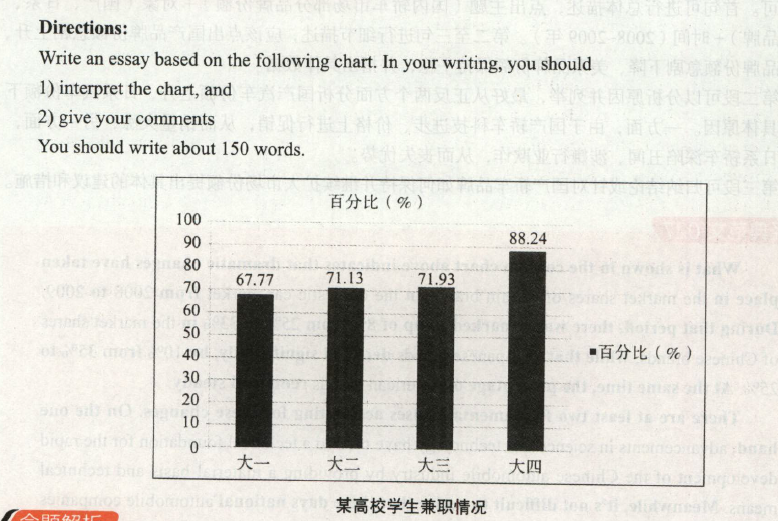

# 2013

## 小作文

Dear Fellow Classmete:  
&emsp;&emsp;Our class is hold charise sale to raise money for these children who are in need of help on January,5,2014. As the monitor of our class,I'm calling on all students to take part in the sale.  
&emsp;&emsp;We ask you to donate as much as you can to fund we have set up to cover these children's tuition fees and other expense.Unless we can raise sufficient money,those poor kids won't be able to afford to finished ther education.  
&emsp;&emsp;As a nation renowned worldwide for its many vritus,China ana its people have been giving a helping hand to those who are in distress thoughthout history. It's our duty to provide as much support as we can those in need.Please contribute generously.

## 大作文

The column chart clearly reveals the statistics of students taking part-time jobs in a certain university. According to the survey, there has been a steady increase from 67.77%to 71.93% of students from freshmen to juniors holding temporary jobs, while the percentage of seniors working part-time has jumped markedly to 88.24%.

While part-time work does have the potential to negatively affect college students' studies, it can also be good for their future careers. It's obvious that doing a part-time job can adversely affect students' studies because it drains their energy. Part-time employmentcan also be detrimental to students by damaging their incentive to study. Despite the abovedisadvantages, working part-time on campus also offers several potential benefits. For one, it can help students better understand their preferences or to test out a possible career direction. Additionally, companies seeking to recruit fresh graduates will give preference to those with part-time experience.

In the end, the impact of part-time work on students' academic performance depends on their ability to maintain a balance between their studies and the part-time job. If students are able to manage their time effectively and secure a part time position in a field related to their studies or interests, the job is certain to yield a positive impact.

> 这幅柱状图清晰地提示了某高校学生兼职情况的数据。调查显示，从大一到大三，兼职学生的比率从67.77%稳步上升到71.93%，而大四兼职学生的百分比则急剧上升到88.24%。
>
> 尽管兼职可能会对大学生的学习有些负面影响，但也对他们未来的工作有益。很明显，兼职会影响学生学业，因为兼职会消耗学生的精力。兼职对学生不利的另一方面是，它会破坏学生的学习动力。尽管有以上弊端，但在大学阶段做兼职还是有很多好处的。首先，兼职能帮助学生更子地了解自己的喜好或检验一 种可能的职业方向。其次，那些招聘应届毕业生的公司会优先选择有兼职经验的大学生。
>
> 总之，兼职对大学生学业的影响取决于他们是否能够平衡花在学习和兼职上的精力。假如他门能有效管理自己的时间，找到符合自己所学或兴趣的兼职岗位，那么兼职必定会对他们产生积极及的影响。