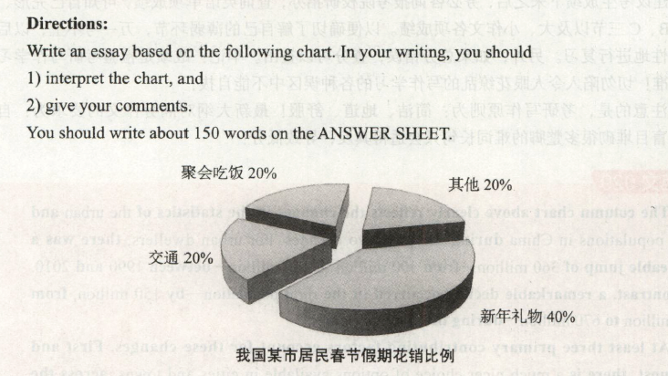

# 2015

## 小作文

Dear Friends,    
&emsp;&emsp;AS the host of the upcoming reading session, I am writing this email to recommend to you my favorite book *Tao Te Citing*, which was written by Lao Tzu.     
&emsp;&emsp;The primary causes of my recommendation are as follows. To begin with, it is the best-loved of all the classical books of China and the most universally popular. In addition,the book encapsulates the main tenets of Taoism, and upholds a way of being as well as a philosophy and  a religion. The dominant image in the book is of the Way, the mysterious path through the whole cosmos modeled on the Milky Way that traverses the heavens.     
&emsp;&emsp;I hope the above information will help you to understand the book. If you need any further information about this selection, please do not hesitate to contact me.    

## 大作文

The pie chart above clearly ilustrates the percentage of the residents' spending in a certain city of China during the Spring Festival Vacation. From the statistics given, we may draw the conclusion that the spending on New Year presents is highest among all the four categories, at approximately 40%, whereas the amount spent on transport, gathering and dining, and miscellaneous accounts for about 20% each.

The fundamental factors that contribute to the aforementioned comparison may be summarized as follows. To start with, a New Year gift might be memorable because of the special occasion when it is given. If the present is something that only your best friend knew you had wanted, you will never forget it, since it shows the closeness of your relationship with that friend. In addition, festival presents might be unforgettable since they are related to significant events in your life. For instance, I still remember the first New Year gift my best friend, Leo, gave me.

In summary, people spend a lot on Spring Festival presents for a large number of reasons. Some gifts might be memorable owing to the special person who gave the gift. Others are unforgettable due to the significance of the event. Most of all, it is easy to remember special presents as they give you a signifcant sense of personal worth.

> ​    上述饼状图清楚地揭示了中国某市居民春节假期的花销比例。根据给出的数据，我们可以得出结论：新年礼物所占的开支在四种类别中最高，大约为40%；而交通、聚会吃饭和其他的开支比例各占20%。
>
> ​    造成上述对比的主要原因可以概括如下：首先，一.份春节礼物之所以令人难忘，是因为送礼物的时机本身很特别。如果只有最好的朋友才知道你想要那份礼物，并把它送给了你，你一辈子都不会忘记，因为这份礼物代表着你们两人深厚的友谊。其次，春节礼物之所以令人难忘，是因为这些礼物与生命中的重大事件相关。比如，我还记得我最好的朋友列奥送给我的第一-份新年礼物。
>
> ​    总之，人们在新年礼物上花销巨大是出于多种原因。有些礼物之所以令人难忘，是因为送礼物的人本身很特别；有些礼物则是因为与重大事件有关。而最重要的原因是特别的礼物会带给你无比的自尊。