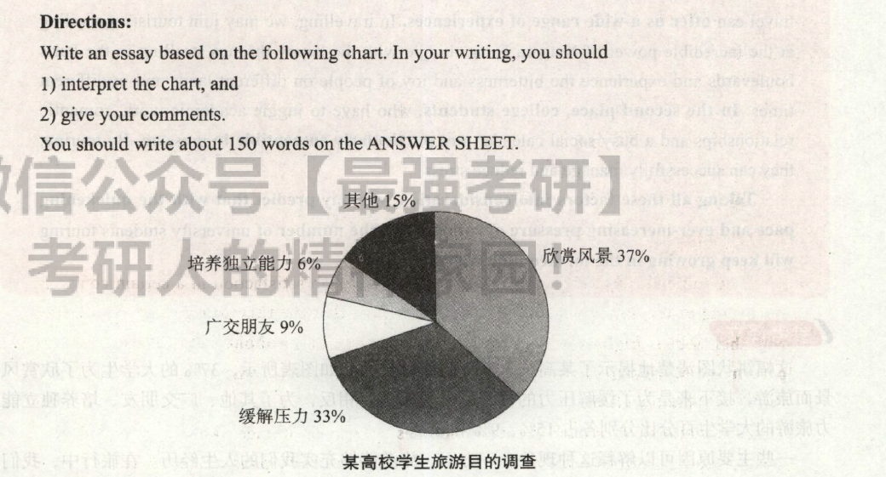

# 2016

## 小作文
Dear Jack,   
&emsp;&emsp;Thanks for your congratulations! Since you asked for advice on translation,I'd like to offer several constructive proposals as follows.     
&emsp;&emsp;First of all, while quite a number of students think they're forced to learn translation merely for English tests, you should learn it for some other purposes like its usefulness other than the examination itself. What is more, in order to become an outstanding translator, it is vital to not only appreciate the beauty and perfection of the language and literature of both English and Chinese, but also to arouse in yourself an interest in exploring something deeper in this filed.    
&emsp;&emsp;I'm sure you'll be an excellent tanslator. Looking forward to your reply!

## 大作文

This pie chart clearly illustrates the purposes of touring for students in a certain university. As is reflected by the diagram, 37 percent of college students travel in order to appreciate the scenery. Next comes the aim of relieving pressure, accounting for 33 percent.By contrast, the percentages of students travelling aiming at other goals, making friends and cultivating independence account for 15%,9% and 6% respectively.

Several primary factors could contribute to this phenomenon. In the first place, travel can offer us a wide range of experiences. In travelling, we may join tourists marvelingat the incredible power of Niagara Falls, mingle with the happy throngs strolling in the Parisboulevards and experience the bitterness and joy of people on different lands and in different times. In the second place, college students, who have to juggle academic work, romantic relationships and a busy social calendar, are particularly susceptible to pressure. By touring, they can successfully manage and reduce stress.

Taking all these factors into consideration, we may predict that with the quickening pace and ever-increasing pressure of campus life, the number of university students touring will keep growing in the forthcoming decade.

> 这幅饼状图清楚地揭示了某高校大学生的旅游目的。如图表所示，37%的大学生为了欣赏风景而旅游，接下来是为了缓解压力的目的，占了33%。相反，为了其他、广交朋友、培养独立能力旅游的大学生百分比分别各占15%、9%和6%。
>
> 一些 主要原因可以解释这种现象。一方面，旅游能够充实我们的人生经历。在旅行中，我们可以和游客一-起，赞叹尼亚加拉瀑布那雷霆万钧之势，和喜洋洋的人群一-起穿过巴黎的林荫大道，还可以体验不同时代、不同国土上人们的酸甜苦辣。另一 方面，大学生不得不应对学习、恋爱和繁忙的社交日程，很容易感受到压力。通过旅游，他们可以成功地应对并缓解压力。
>
> 考虑到所有这 些因素，我们可以预计：随着校园生活节奏的加快和日益增大的压力，旅游的大学生数量在未来几年将持续增加。