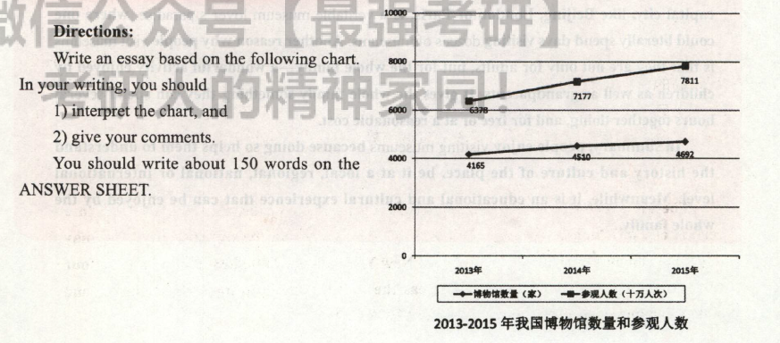

# 2017

## 小作文

Dear Prof. Williams,    
&emsp;&emsp;I am extremely honored to accept your invitation to give a presentation to a host of foreign students on Chinese culture.    
&emsp;&emsp;Here are the key points of my presentation. First of all, compared with Westerners, the Chinese people have traditionally paid more attention to the harmonious relationship between human beings and nature. "Nature and Man are one" is a familiar statement in traditional Chinese ideology. In addition, in Chinese thought, much emphasis is laid upon moral cultivation, the refinement of temper, and the spiritual enlightenment on the part of individual rather than upon logical reasoning.    
&emsp;&emsp;My appreciation to you for your generous help is beyond words.I am looking forward to hearing from you soon.

## 大作文

The line graph clearly illustrates that the number of museums in China and their number of visitors both increased markedly between 2013 and 2015. Based upon the data given above, we can see that the number of museums has risen dramatically from 4,165 to 4,692 during the three years, while the amount of visitors jumped from 637 million to 781
million in the same time.

Museums hold an attraction and fascination for most people, of all ages, from young children to the elderly, for at least two fundamental reasons. The first reason many people are interested in visiting a museum is to learn about the history and culture of a place. A country's capital city, like Beijing, London or Paris, is a veritable museum lover's paradise, where onecould literally spend days visiting dozens of museums. Another reason why people visit museums is that they are not only for adults, but for the whole family--a wonderful activity enjoyed by children as well as grandparents. It gives the whole family something they can spend several hours together doing, and for free or at a reasonable cost.

In summary, people enjoy visiting museums because doing so helps them to understand the history and culture of the place, be it at a local, regional, national or international level. Meanwhile, it is an educational and cultural experience that can be enjoyed by the whole family.

>    这幅线状图清晰地显示，从2013年到2015年，中国博物馆的数量和参观人数均急剧上升。根据上述数据，我们可以看出在这三年中，博物馆的数量从4165所迅猛增加至4692所，而与此同时，参观人数的数据从6.37亿急剧上升至7.81亿。
>
>    博物馆吸引着大多数人，从小孩到老人，各个年龄层的人无不为博物馆着迷，至少有两个根本原因。第一个原因，许多游客对参观博物馆感兴趣是为了了解当地的历史和文化。-国的首都，如北京、伦敦或巴黎，简直就是博物馆爱好者的天堂，一个人可以花数天时间参观许多博物馆。另一个原因，参观博物馆不仅是成年人的消遺，还是全家人的极好的活动，老人和小孩都喜欢。不管是免费还是得花合理的费用，参观博物馆给一家人提供了好几个小时待在一起的机会。
>
> 总之，人们喜欢参观博物馆一无论是 当地、地区级、国家级还是世界级的博物馆一一是因为这样能帮助他们了解当地的历史和文化。同时，全家人去逛博物馆也是一件乐事，能从中学到知识，感受文化。