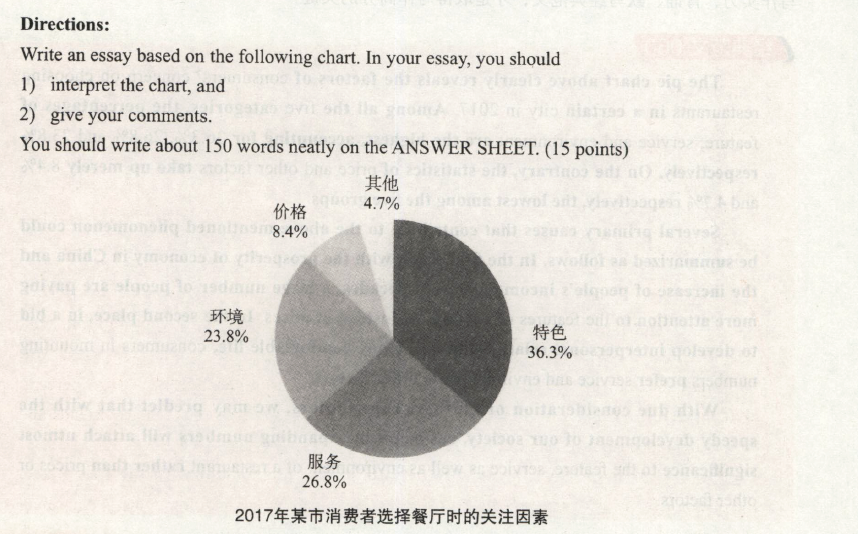

# 2018

## 小作文
Dear Professor Smith,     
&emsp;&emsp;I am looking forward to my traveling to the United States and visiting you in Harvard University.    
&emsp;&emsp;Unfortunately,I have recently been diagnosed with a serious ear infection which will require surgery on the same day as my departure.I am sorry to say that I will therefore not be able to make the travel plan. If possible,I would like to postpone the travel plan toanother day later in this year. I promise that such a situation does not usually happen, and apologize for any inconvenience this may cause you.    
&emsp;&emsp;Please excuse me for not being able to inform you of my situation sooner. Your prompt attention to my suggestion would be highly appreciated.   

## 大作文

The pie chart above clearly reveals the factors of consumers' concern on choosing restaurants in a certain city in 2017. Among all the five categories, the percentages of feature, service and environment are the highest, accounting for 36.3%,26.8% and 23.8%respectively. On the contrary, the statistics of price and other factors take up merely 8.4%
and 4.7% respectively, the lowest among the five groups.

Several primary causes that contribute to the above-mentioned phenomenon could be summarized as follows. In the first place, with the prosperity of economy in China and the increase of people's income in recent decades, a large number of people are paying more attention to the features of a restaurant instead of prices. In the second place, in a bid to develop interpersonal relationship and enjoy comfortable life, consumers in mounting numbers prefer service and environment to other factors.

With due consideration of all these contributors, we may predict that with the speedy development of our society, customers in expanding numbers will attach utmost significance to the feature, service as well as environment of a restaurant rather than prices or other factors.

> 上述饼状图清晰揭示了2017年某市消费者选择餐厅时关注的因素。在所有五组数据中，特色、服务、环境的百分比是最高的，分别占36.3%，26.8%和23.8%。相反，价格和其他因素的数据只占8.4%和4.7%，在这五组中是最低的。
>
> 造成上述现象的主要原因可以概括如下。首先，随着中国经济的繁荣和近几十年来人们收人的增加，很多人越来越关注餐厅的特色，而不是价格。其吹，为了拓展人际关系，享受舒适的生活，越来越多的消费者选择服务与环境而非其他。
>
> 考虑到所有这些因素，我们可以预计，随着社会的迅速发展，越来越多的消费者将更加重视餐厅的特色、服务、环境，而不是价格或其他因素。