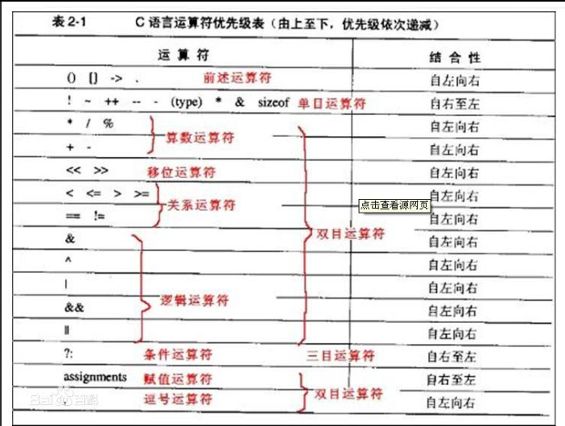

# C语言错题集





## switch

```C
#include <stdio.h>

int main () {
	int n= 'e';
	switch(n--)
	{
		default: printf("error");
		case 'a':
		case 'b': printf("good");break;
		case 'c': printf("pass");
		case 'd': printf("warn");
	}
	return 0;
}

```

执行结果为：

> error good

## 字符串的操作

- 比较 `int strcmp(const char* stri1，const char* str2);`  返回值为str1-str2
- 合并`char*strcat(char* desc, const char* src);`   desc目的，src源
- 复制 `char* strcpy(char* desc, const char* src);`