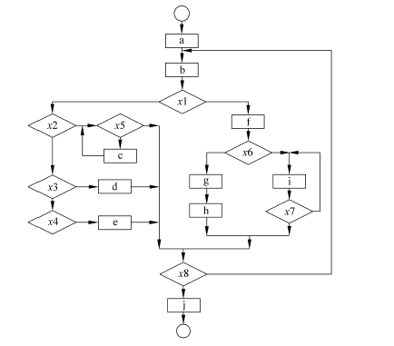
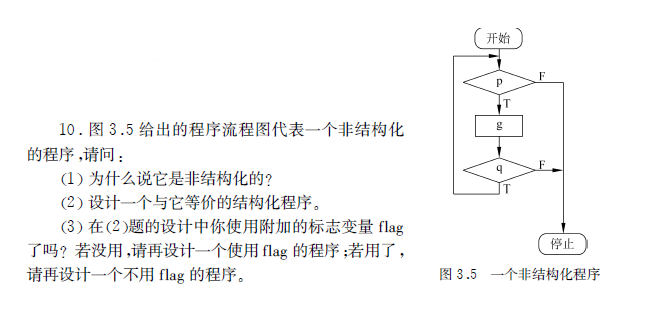
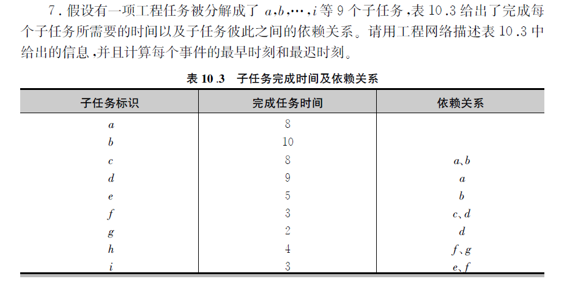
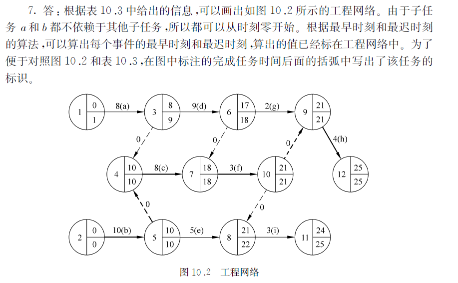

# 软件工程习题集


## 第三章

### 7.程序流图转盒图




### 9. 根据伪码画出程序流图和盒图

```
START
IF P THEN
    WHILE q DO
         f
    END DO
ELSE
    BLOCK
        g
        n
    END BLOCK
END IF
STOP
```


### 10 非结构化转结构化




### 7.工程网络图






### 


### 7.


### 7.


### 7.


### 7.